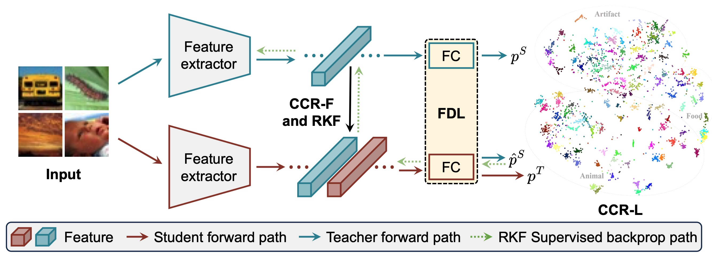

# MFAA

This repo provides a demo for the paper "Multi-view Feature Adjustment and Alignment for Knowledge Distillation" on the CIFAR-100 dataset.

## Requirements
- python 3.9.12 (Anaconda version >=5.3.1 is recommended)
- torch (torch version >= 2.8.0.dev20250429+cu128 is recommended)
- torchaudio (torchaudio version >= 2.6.0.dev20250429+cu128 is recommended)
- torchvision (torchvision version >= 0.22.0.dev20250429+cu128 is recommended)
- pandas
- numpy
- tensorboard_logger
- NVIDIA GPU + CUDA CuDNN

## Datasets
- CIFAR-100, CIFAR-100-C, STL-10, SVHN, TinyImageNet, and ImageNet

## Getting started
- Download datasets and extract it inside  `data`
- Teacher Training: `train_teacher.py --model wrn_40_2`
- Student Training: `python train_student_mfaa.py --dataset cifar100 --path_t ./save_t/wrn_40_2/ckpt_epoch_240.pth --distill mfaa --model_s wrn_16_2`
- Evaluate Sample:
  - Download the preprocessed cross-category relationship matrix at this [link](https://drive.google.com/file/d/18tafoV4vgGLrQdMBqokU94v-LgrpLp_H/view?usp=sharing) and extract them in the `ccr_cost_matrix` directory..
  - Distilled teacher-student model pairs of resnet32x4/resnet8x4 and vgg13/mobilenetV2 for CIFAR-100 are available at this [link](https://drive.google.com/file/d/1OFKjy6obUMpRCQUZAMdGZcKExoGsUAv1/view?usp=sharing). Download and extract them in the `save_mfaa` directory.
  - You can achieve the top-1 classification accuracy of 78.01% and 72.52% on CIFAR-100 datasets.

## Acknowledgement
- Thanks for PACKD and SSKD. We build this library based on the [PACKD's codebase](https://github.com/smuelpeng/PACKD) and [SSKD's codebase](https://github.com/xuguodong03/SSKD).